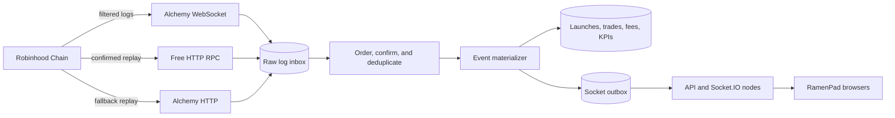
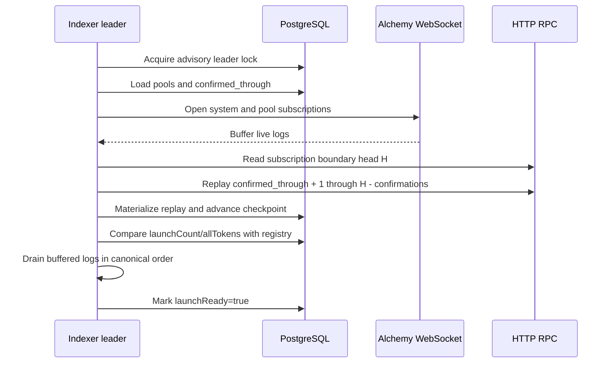

# Scalable live indexing architecture

Status: approved design, not yet the production implementation  
Date: 2026-09-02

## Decision

RamenPad should use a hybrid event pipeline:

- An authenticated Alchemy WebSocket is the primary low-latency source for relevant contract logs.
- Durable HTTP `eth_getLogs` reconciliation remains the source of completeness after restarts, disconnects, deploys, and provider incidents.
- PostgreSQL is the source of truth for raw event identities, materialized launchpad data, and contiguous reconciliation checkpoints.
- Browsers continue to receive sanitized application events through the existing Socket.IO service. Paid RPC credentials never reach a browser.

This change does not require a contract upgrade or redeployment.



## Objectives

The pipeline must provide:

- A normal live-event latency target below two seconds after the configured confirmation depth.
- No missed launch, trade, claim, harvest, or protocol-deposit event after a backend outage.
- Idempotent processing when the same event arrives from WebSocket, replay, or reconciliation.
- Predictable RPC usage as the launchpad grows from tens to thousands of pools.
- A launch-readiness signal that fails closed during deployment or indexing degradation.
- Horizontal API scaling without allowing two indexers to race.

## Components

### 1. Subscription manager

Maintain two types of filtered `eth_subscribe` subscriptions:

1. A system subscription for the launcher, permanent locker, and in-app swapper, filtered to the `TokenLaunched`, fee, claim, protocol-deposit, and routed-swap topic-zero values.
2. Pool subscriptions sharded into configurable groups of 100 pool addresses, filtered to the Uniswap v3 `Swap` topic.

The shard size is an operational default, not a correctness assumption. It can be reduced if a provider imposes a smaller subscription-filter limit.

When `TokenLaunched` reveals a new pool, the manager must:

1. Add the pool to the durable registry.
2. Open the replacement subscription before closing the old shard subscription.
3. Record the replacement boundary block.
4. Replay that pool from its launch block through the confirmed boundary.
5. Activate the new subscription and retire the old one.

All overlap is harmless because event identities are unique.

Do not subscribe to unfiltered logs or every `newHeads` event. Robinhood Chain produces blocks quickly, so those feeds would turn idle chain activity into avoidable bandwidth usage. A low-frequency HTTP block-height check is sufficient for confirmation tracking.

### 2. Raw log inbox

Both live and replayed logs enter the same table before business logic runs. Add a `ramenpad.raw_chain_logs` table with at least:

| Field | Purpose |
| --- | --- |
| `chain_id` | Prevents cross-network collisions. |
| `block_number`, `block_hash` | Ordering and reorg detection. |
| `tx_hash`, `log_index` | Canonical event identity. |
| `address`, `topic0`, `topics`, `data` | Lossless decoding input. |
| `source` | `websocket`, `replay`, or `reconciliation`. |
| `removed` | Records WebSocket reorg removals. |
| `received_at`, `processed_at` | Lag and queue observability. |

Use `(chain_id, block_hash, tx_hash, log_index)` as the raw-log identity so an orphaned and replacement-chain copy can coexist during reorg handling. Materialized rows reference a unique `source_log_id`. An upsert may enrich the source or mark that exact raw log removed, but it must not create another business event. When a block is orphaned, delete/reverse its materialized rows by `source_log_id` before materializing the canonical replacement.

### 3. Confirmation and ordering worker

The worker processes raw logs in `(block_number, transaction_index, log_index)` order only after `chainHead - confirmationDepth` reaches their block. The initial confirmation depth remains two blocks and must be configurable. Receiving a log schedules a debounced HTTP `eth_blockNumber` check until the pending block is confirmed; a 15-second idle check is only a fallback. This keeps confirmation latency activity-driven without paying for the chain's full `newHeads` stream.

Ordering guarantees that a `TokenLaunched` event registers its pool before a same-transaction `Swap` is materialized. A missing pool reference delays that event; it never drops it.

Each block or replay range is committed in one database transaction:

1. Insert/upsert raw logs.
2. Materialize launches, trades, fee harvests, claims, and protocol deposits.
3. Append browser messages to an outbox.
4. Advance the contiguous checkpoint.
5. Commit.

A decode or database error rolls back the transaction and leaves the checkpoint unchanged.

### 4. Materialized application tables

Keep the existing `launches`, `trades`, `fee_harvests`, `fee_claims`, and `protocol_fee_deposits` tables. Add the indexed onchain `launch_id` to `launches` with a unique constraint.

During migration, preserve the existing transaction-hash/log-index constraints while adding `source_log_id`. Reorg rollback removes the orphaned source rows before a replacement is materialized, even if its block-global log index changes. Metadata updates signed by a token launcher remain application state and must not be overwritten by an old event replay.

### 5. Durable checkpoints

Replace the single ambiguous cursor with explicit stream state:

| Checkpoint | Meaning |
| --- | --- |
| `confirmed_through` | Every watched address was reconciled through this block. |
| `ws_connected_at_block` | Boundary captured when the current subscriptions connected. |
| `last_reconciled_at` | Age of the last complete audit scan. |
| `registry_launch_count` | Last launcher `launchCount()` proven against the database. |

Only `confirmed_through` is a completeness guarantee. Receiving a later WebSocket event must never jump this checkpoint over an unscanned gap.

## Gap-free startup and reconnect

Startup order is important. Scanning first and subscribing afterward creates a race window.



The same sequence runs after a WebSocket disconnect. While disconnected or catching up, the health endpoint reports `launchReady=false`. Direct contract calls and already-open wallet prompts remain recoverable through replay.

## Reconciliation and backfill

Run a complete confirmed-range reconciliation every ten minutes even while the WebSocket is healthy. The scan should:

- Query the three system contracts together.
- Query pool addresses in shards.
- Start at `confirmed_through + 1` and end at the safe head.
- Use provider-specific block-range limits and bisect a range when a response-size limit is hit.
- Retry 429 and transient failures with exponential backoff plus jitter.
- Try free archive-capable HTTP providers first and paid Alchemy HTTP last.
- Advance only after every system and pool shard succeeds.

On every startup and periodically afterward, compare the contract's `launchCount()` and `allTokensLength()` with the database's launch IDs. A mismatch is an alert and triggers targeted event replay. The launcher's `allTokens(index)` and `launches(token)` getters provide a second discovery route if the database cursor is damaged; the `TokenLaunched` log remains necessary to recover the original image URL and pricing fields.

## Readiness policy

`GET /health/ramenpad` should expose these non-secret fields:

- `launchReady`
- `leader`
- `wsConnected`
- `systemSubscriptionReady`
- `poolShardsReady` and `poolShardsExpected`
- `confirmedThrough` and `safeHead`
- `confirmedLagBlocks`
- `lastReconciledAt`
- `rawQueueDepth`
- `consecutiveFailures`
- aggregate free/paid provider successes and failures

`launchReady` is true only when:

- Database migrations and the indexer leader lock are healthy.
- The system subscription and every current pool shard are connected.
- Startup/reconnect replay is complete.
- The raw queue has no stuck earlier block.
- The WebSocket confirmation queue is current and the last complete reconciliation is younger than the configured maximum age. Reconciliation block lag is still reported for alerting.

The frontend retains its non-cacheable readiness check immediately before all three launch paths: launch only, launch plus ETH first buy, and launch plus RAMEN first buy.

## Provider and cost policy

Use this order:

1. Alchemy WebSocket for filtered live events.
2. Public/free HTTP RPC for state reads, head checks, and ordinary replay where supported.
3. Authenticated Alchemy HTTP only for failed or unsupported recovery requests.

Alchemy currently prices `eth_getLogs` at 60 compute units. WebSocket log delivery is bandwidth-based; Alchemy estimates a typical 1,000-byte subscription event at roughly 40 compute units. Their free tier currently includes 30 million compute units monthly. See [Alchemy compute-unit costs](https://www.alchemy.com/docs/reference/compute-unit-costs) and [pricing plans](https://www.alchemy.com/docs/reference/pricing-plans).

At fewer than 100 pools, the old 15-second polling design performs about 345,600 `eth_getLogs` calls per month, or roughly 20.7 million compute units if all calls reach Alchemy. Each additional 100-pool shard adds about 10.4 million monthly compute units.

The hybrid design makes live cost proportional to actual RamenPad activity. Ten-minute reconciliation adds bounded requests, and paid HTTP usage occurs only when free recovery routes fail. Metrics must record request count, compute-unit estimate, returned bytes, and provider tier.

## Multi-instance operation

- Run any number of stateless HTTP/Socket.IO API instances.
- Permit exactly one indexer leader using a PostgreSQL advisory lock.
- Let a standby acquire the lock and execute the full reconnect sequence if the leader dies.
- Publish committed outbox messages only after their database transaction succeeds.
- Add the Socket.IO Redis adapter only when API nodes exceed one; PostgreSQL remains authoritative.
- If event volume eventually exceeds one materializer, partition work by pool address while keeping launcher/system events on a single ordered partition.

## Failure behavior

| Failure | Required behavior |
| --- | --- |
| WebSocket disconnect | Set readiness false, reconnect, replay the checkpoint gap, then resume. |
| Free RPC 429/timeout | Retry with jitter, reduce range, then use paid HTTP fallback. |
| Backend deployment | New instance catches up before readiness; frontend pauses launches. |
| Duplicate live/replay event | Raw-log upsert and materialized unique keys make it a no-op. |
| Reorg/`removed` log | Mark raw log removed, reverse/rebuild affected materialized block, replay canonical logs. |
| Decode or database error | Roll back range/block and do not advance the checkpoint. |
| New pool subscription race | Subscribe first, replay from launch block, then retire the prior shard. |
| Database/contract launch-count mismatch | Set readiness false and run targeted launch reconciliation. |

## Configuration

Add or retain these backend-only settings:

```dotenv
RAMENPAD_INDEXER_MODE=hybrid
ROBINHOOD_WS_URL=wss://robinhood-mainnet.g.alchemy.com/v2/...
ROBINHOOD_FREE_RPC_URLS=https://robinhood-rpc.publicnode.com
ROBINHOOD_LOG_RPC_URLS=https://rpc.mainnet.chain.robinhood.com
ROBINHOOD_PAID_RPC_URLS=https://robinhood-mainnet.g.alchemy.com/v2/...
RAMENPAD_WS_POOL_SHARD_SIZE=100
RAMENPAD_CONFIRMATION_BLOCKS=2
RAMENPAD_RECONCILE_INTERVAL_MS=600000
RAMENPAD_MAX_RECONCILE_AGE_MS=720000
```

The Alchemy key must be stored only in the backend secret store, never in Git, Vercel frontend variables, API responses, or browser bundles.

## Rollout plan

1. **Persistence foundation:** add raw logs, explicit checkpoints, launch IDs, transactional materialization, and advisory leader locking while retaining polling.
2. **WebSocket shadow mode:** connect Alchemy, store WebSocket logs, but let the existing confirmed scanner remain authoritative. Compare event identity and lag for at least 24 hours.
3. **Hybrid cutover:** make WebSocket the live path and reduce complete HTTP reconciliation to ten-minute intervals. Keep paid HTTP as the final fallback.
4. **Dynamic pool hardening:** enable overlap-and-replay shard replacement and test a launch with a same-transaction atomic first buy.
5. **Horizontal API scale:** introduce outbox delivery and the Socket.IO Redis adapter if a second API node is added.

Each phase must be independently reversible without deleting indexed data or changing contracts.

## Acceptance tests

The implementation is complete only after these tests pass:

- Launch normally and receive the launch plus atomic first-buy events once.
- Stop the backend, launch directly through the contract, restart, and recover all metadata and trades.
- Disconnect the WebSocket during active trading and prove replay fills the exact gap without duplicates.
- Deliver WebSocket and replay copies of the same event in both orders.
- Force 429s and timeouts on free HTTP and verify bounded paid fallback.
- Simulate a removed log/reorg and rebuild the affected materialized block.
- Add a pool while its shard is being replaced and capture its first swap.
- Restart two backend instances together and prove only one holds the indexer lock.
- Compare database launch IDs with `launchCount()` after every recovery scenario.
- Load-test at 100, 1,000, and 10,000 registered pools and record RPC calls, bandwidth, queue lag, and database latency.

Production cutover requires zero missing identities between shadow WebSocket input and reconciliation over the observation window.
